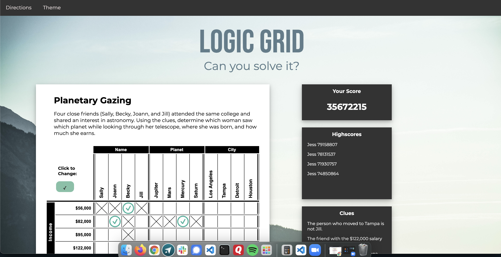

# Logic Grid
Logic Grid is a website for those who love logic puzzles, but wants a site that has a calm, modern interface that allows for easier concentration without the distractions of ads and pop-ups. 

### [View the Demo](...)
<br>



## Installation
To install program fork the program and copy the ssh link. Navigate to the folder of choice using  ```cd folder_name/``` replacing folder_name with the correct name. Once in the folder type ```git clone ssh_link``` replacing ssh_link with the one that was obtained earlier and hit enter. To run type ```npx serve``` and go to http://localhost:5000 in browser to use the app.

To use with API please fork that repo and follow directions in its readme.

## Backend API
Located at https://github.com/JessAntunes/logic-grid-backend

## Contributors
If you wish to contribute to this program please submit a pull request or a new issue.

## License
This program is licensed under The MIT License (https://opensource.org/licenses/MIT). License file included.

